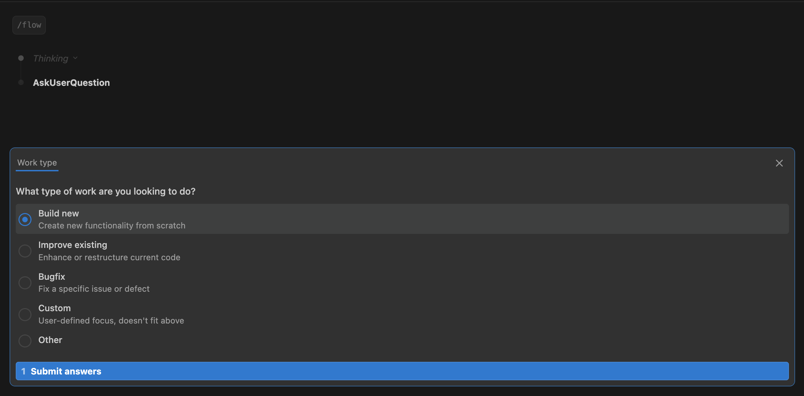
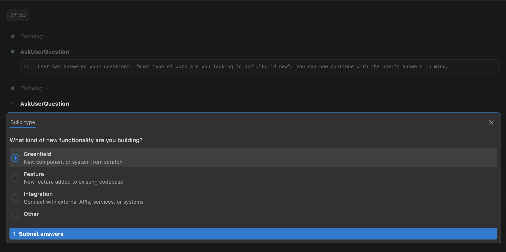
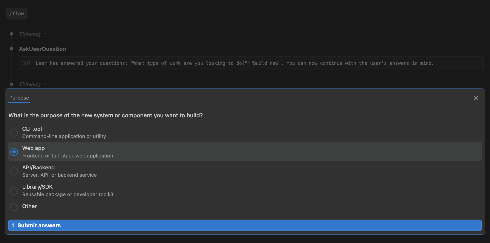
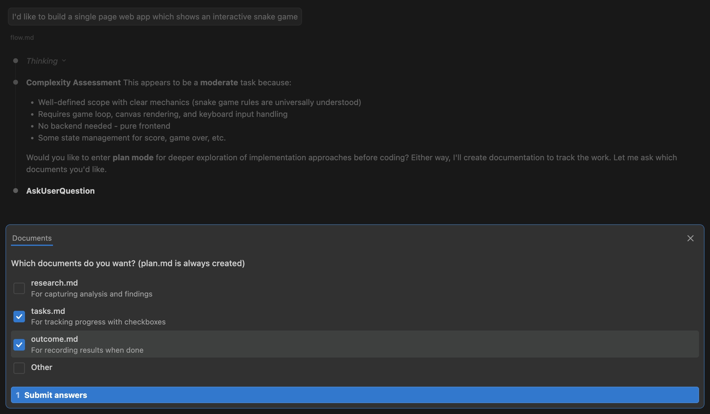
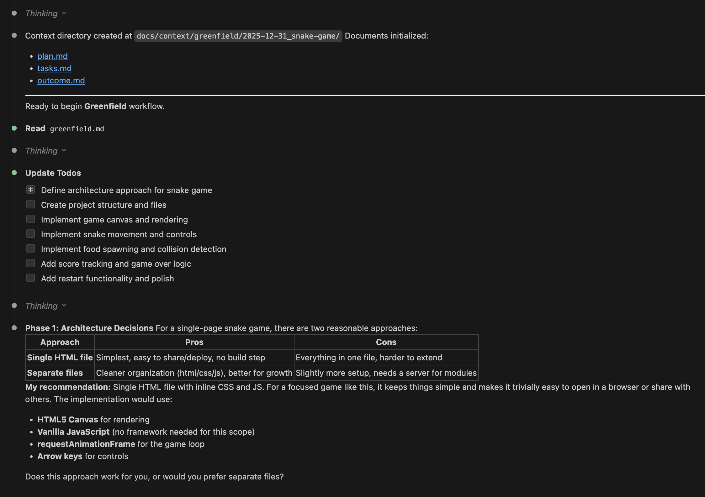

# Claude Code Flow

*Stay in the flow.*

[](LICENSE)

A structured but flexible development workflow system for Claude Code. Guides you through feature development, refactoring, optimization, greenfield projects, and bugfixes with consistent documentation practices.

Extends the research → plan → implement paradigm, keeping Claude laser focused on relevant context while solving the chronic amnesia problem in long sessions.

## What It Does

The `/flow` command initiates structured workflows that:

- **Defeat Claude's amnesia** - context persists in documentation that survives session resets, context compaction, and timeouts
- **Resume instantly** - reference a `docs/context/` path and pick up exactly where you left off, even days later
- **Learn from past work** - patterns, lessons, and gotchas accumulate in `.memory/` and inform future flows
- **Stay on track** - phased workflows (understand → plan → implement → complete) with validation checkpoints prevent drift
- **Get tailored guidance** - type-specific workflows for features, bugfixes, refactors, integrations, and more
- **Reduce cognitive load** - Claude explores your codebase first, only asking questions when genuinely blocked

## What's Included

- **`/flow` command** - Initiates new workflows, infers work type from your description
  - Automatically searches past flows for related work before starting
  - Offers to review relevant patterns and lessons from previous work
- **`/flow-search` command** - Search past flows for context, patterns, and lessons
  - Finds relevant past work by keyword
  - Surfaces lessons learned from completed flows
- **`flow-skill` skill** - Auto-activates when you reference a context directory path
  - Phase-by-phase guidance: understanding → planning → implementation → completion
  - Progressive disclosure: Claude sees only what's relevant to the current phase
  - Work-type specific: tailored guidance for features, refactors, optimizations, etc.
  - Answers "Have I done this before?" queries by searching past flows
- **`detect-workflow` hook** - Automatically injects guidance based on what you're doing
  - Applies work-type principles even outside formal `/flow` sessions
  - Say "fix the login bug" and bugfix guidance applies automatically
  - Opportunistic refactoring mid-task? Refactor principles kick in

## Work Types

| Type | When to Use |
|------|-------------|
| **Greenfield** | New component/system from scratch |
| **Feature** | New feature added to existing codebase |
| **Integration** | Connect with external APIs, services, or systems |
| **Refactor** | Restructure or reorganize existing code |
| **Optimization** | Performance, efficiency, resource usage |
| **Bugfix** | Fix a specific issue or defect |
| **Custom** | User-defined focus; doesn't fit above categories |

## Memory System

Flow learns from your work. The `.memory/` directory accumulates knowledge across flows:

```
docs/context/.memory/
├── patterns.md      # Reusable solutions (auth strategy, error handling, etc.)
├── lessons.md       # What worked, what didn't
├── architecture.md  # System structure insights
├── conventions.md   # Naming, file organization, code style
└── gotchas.md       # Project-specific pitfalls
```

**How it works:**
- **Flow start**: Claude reads `.memory/` to inform understanding and planning
- **Flow end**: Lessons and patterns are extracted to `.memory/` for future flows
- **Invisible infrastructure**: You don't manage it directly; Claude reads/writes automatically

The memory is project-specific and should be gitignored (it's your project's learned context, not part of the framework).

## Context Directory Structure

Each workflow automatically creates and maintains a timestamped directory with standardized documents:

```
docs/context/
├── .memory/                              # Accumulated knowledge (see above)
│   ├── patterns.md
│   ├── lessons.md
│   └── ...
├── feature/
│   ├── 2025-01-15_user-authentication/
│   │   ├── plan.md
│   │   ├── research.md
│   │   ├── tasks.md
│   │   ├── outcome.md
│   │   └── api_design.md
│   └── 2025-01-22_export-api/
│       ├── plan.md
│       └── tasks.md
├── bugfix/
│   └── 2025-01-18_login-timeout/
│       ├── plan.md
│       └── research.md
├── optimization/
│   └── 2025-01-20_query-performance/
│       ├── plan.md
│       ├── research.md
│       └── tasks.md
└── refactor/
    └── 2025-01-10_payment-module/
        ├── plan.md
        ├── research.md
        ├── tasks.md
        └── outcome.md
```

Standard documents:
- **plan.md** - Implementation plan, goals, success criteria
- **research.md** - Analysis and findings from codebase exploration
- **tasks.md** - Task tracking with checkboxes
- **outcome.md** - Results and lessons learned

For simple tasks, you may skip documents that wouldn't add value - but most workflows benefit from all four.

Additional documents can be created as needed (e.g., `api_design.md`, `notes.md`, `diagrams.md`).

## Auto-Activation

Two mechanisms ensure guidance is always available:

**Skill activation** - The flow-skill activates when you reference a `docs/context/` path (e.g., "let's continue working on docs/context/bugfix/2025-01-18_login-timeout"). Claude detects the work type from the directory path and loads the appropriate guidance.

**Hook detection** - The detect-workflow hook analyzes every prompt for work-type keywords and injects relevant guidance automatically. This means you get bugfix principles when fixing bugs, refactor guidance when restructuring code, etc. - even without starting a formal `/flow` session. See [hooks/README.md](hooks/README.md) for technical details.

## Installation

Clone this repo and symlink to your Claude Code configuration:

```bash
git clone https://github.com/andrasp/claude-code-flow.git

# Commands and skill
ln -s /path/to/claude-code-flow/commands/flow.md ~/.claude/commands/flow.md
ln -s /path/to/claude-code-flow/commands/flow-search.md ~/.claude/commands/flow-search.md
ln -s /path/to/claude-code-flow/skills/flow-skill ~/.claude/skills/flow-skill

# Hook (optional but recommended)
mkdir -p ~/.claude/hooks
ln -s /path/to/claude-code-flow/hooks/detect-workflow.py ~/.claude/hooks/detect-workflow.py
```

To enable the hook, add to your `~/.claude/settings.json`:

```json
{
  "hooks": {
    "UserPromptSubmit": [
      {
        "matcher": "",
        "hooks": [
          {
            "type": "command",
            "command": "python3 ~/.claude/hooks/detect-workflow.py"
          }
        ]
      }
    ]
  }
}
```

Start a new conversation and the commands, skills, and hook will be available.

## Usage

```bash
# Start a new workflow (interactive mode)
/flow

# Start with description - infers work type, searches for related past work
/flow add user authentication to the API

# Search past flows for relevant context
/flow-search authentication
/flow-search caching patterns

# Resume previous work
continue docs/context/feature/2025-01-15_user-auth
```

## Repository Structure

```
claude-code-flow/
├── commands/
│   ├── flow.md              # /flow slash command
│   └── flow-search.md       # /flow-search slash command
├── skills/
│   └── flow-skill/
│       ├── SKILL.md         # Main skill definition
│       ├── bugfix.md        # Bugfix guidance
│       ├── feature.md       # Feature development guidance
│       ├── greenfield.md    # Greenfield project guidance
│       ├── integration.md   # Integration guidance
│       ├── optimization.md  # Optimization guidance
│       ├── custom.md        # General workflow, user-defined focus
│       └── refactor.md      # Refactoring guidance
└── hooks/
    ├── README.md             # Hook technical documentation
    └── detect-workflow.py    # Auto-detect work type from prompts
```

## See It In Action

Starting a new greenfield project with `/flow`:

**Step 1: Choose work category**



**Step 2: Select specific type**



**Step 3: Define purpose**



**Step 4: Complexity assessment & document selection**



**Step 5: Context created, workflow begins**



The context directory is created, documents are initialized, and Claude begins Phase 1 with architecture decisions tailored to your project.

## Related

- [claude-code-wisdom](https://github.com/andrasp/claude-code-wisdom) - Distilled software engineering wisdom for your CLAUDE.md

## License

MIT License - use however you want.
