# Claude Code Flow

*Stay in the flow.*

[](LICENSE)

A structured but flexible development workflow system for Claude Code. Guides you through feature development, refactoring, optimization, greenfield projects, and bugfixes with consistent documentation practices.

Extends the research → plan → implement paradigm, keeping Claude laser focused on relevant context while solving the chronic amnesia problem in long sessions.

## What It Does

The `/flow` command initiates structured workflows that:

- **Defeat Claude's amnesia** - context persists in documentation that survives session resets, context compaction, and timeouts
- **Resume instantly** - reference a `docs/context/` path and pick up exactly where you left off, even days later
- **Learn from past work** - patterns, lessons, and gotchas accumulate in `.memory/` and inform future flows
- **Stay on track** - phased workflows (understand → plan → implement → complete) with validation checkpoints prevent drift
- **Get tailored guidance** - type-specific workflows for features, bugfixes, refactors, integrations, and more
- **Reduce cognitive load** - Claude explores your codebase first, only asking questions when genuinely blocked

## What's Included

- **`/flow` command** - Initiates new workflows, infers work type from your description
  - Automatically searches past flows for related work before starting
  - Offers to review relevant patterns and lessons from previous work
- **`/flow-search` command** - Search past flows for context, patterns, and lessons
  - Finds relevant past work by keyword
  - Surfaces lessons learned from completed flows
- **`/flow-roadmap` command** - Manage strategic work backlog
  - Prioritized items with dependencies and progress tracking
  - Subcommands: list, add, show, next, block, complete, stats
- **`/validate` command** - Invokes multi-lens code review on your changes
- **`validation-skill` skill** - Parallel specialist reviewers for comprehensive code review
  - 7 reviewers: security, architecture, quality, performance, scalability, testing, error-handling
  - Runs automatically before flow completion, or manually anytime via `/validate`
  - Aggregates findings by severity, auto-remediates critical/high issues
- **`roadmap-skill` skill** - Conversational work planning
  - Natural language: "X depends on Y", "what should I work on next?"
  - Auto-activates when discussing priorities, dependencies, or work items
  - Links to flows: `/flow --roadmap RM-001` connects work to strategic items
- **`autonomous-skill` skill** - Unattended flow execution (experimental)
  - Run flows to completion without human intervention
  - Oversight Agent makes judgment calls normally requiring human input
  - Auto-configures hooks on first use; logs all autonomous decisions
- **`flow-skill` skill** - Auto-activates when you reference a context directory path
  - Phase-by-phase guidance: understanding → planning → implementation → completion
  - Progressive disclosure: Claude sees only what's relevant to the current phase
  - Work-type specific: tailored guidance for features, refactors, optimizations, etc.
  - Answers "Have I done this before?" queries by searching past flows
- **`detect-workflow` hook** - Automatically injects guidance based on what you're doing
  - Applies work-type principles even outside formal `/flow` sessions
  - Say "fix the login bug" and bugfix guidance applies automatically
  - Opportunistic refactoring mid-task? Refactor principles kick in

## Work Types

| Type | When to Use |
|------|-------------|
| **Greenfield** | New component/system from scratch |
| **Feature** | New feature added to existing codebase |
| **Integration** | Connect with external APIs, services, or systems |
| **Refactor** | Restructure or reorganize existing code |
| **Optimization** | Performance, efficiency, resource usage |
| **Bugfix** | Fix a specific issue or defect |
| **Custom** | User-defined focus; doesn't fit above categories |

## Memory System

Flow learns from your work. The `.memory/` directory accumulates knowledge across flows:

```
docs/context/.memory/
├── patterns.md      # Reusable solutions (auth strategy, error handling, etc.)
├── lessons.md       # What worked, what didn't
├── architecture.md  # System structure insights
├── conventions.md   # Naming, file organization, code style
└── gotchas.md       # Project-specific pitfalls
```

**How it works:**
- **Flow start**: Claude reads `.memory/` to inform understanding and planning
- **Flow end**: Lessons and patterns are extracted to `.memory/` for future flows
- **Invisible infrastructure**: You don't manage it directly; Claude reads/writes automatically

The memory is project-specific and should be gitignored (it's your project's learned context, not part of the framework).

## Context Directory Structure

Each workflow automatically creates and maintains a timestamped directory with standardized documents:

```
docs/context/
├── .memory/                              # Accumulated knowledge (see above)
│   ├── patterns.md
│   ├── lessons.md
│   └── ...
├── roadmap/                              # Strategic work backlog
│   ├── index.md                          # Overview and counts
│   ├── items/                            # Individual roadmap items
│   │   ├── RM-001_user-auth.md
│   │   └── RM-002_api-v2.md
│   └── archive/                          # Completed items
├── feature/
│   ├── 2025-01-15_user-authentication/
│   │   ├── plan.md
│   │   ├── research.md
│   │   ├── tasks.md
│   │   ├── outcome.md
│   │   └── api_design.md
│   └── 2025-01-22_export-api/
│       ├── plan.md
│       └── tasks.md
├── bugfix/
│   └── 2025-01-18_login-timeout/
│       ├── plan.md
│       └── research.md
├── optimization/
│   └── 2025-01-20_query-performance/
│       ├── plan.md
│       ├── research.md
│       └── tasks.md
└── refactor/
    └── 2025-01-10_payment-module/
        ├── plan.md
        ├── research.md
        ├── tasks.md
        └── outcome.md
```

Standard documents:
- **plan.md** - Implementation plan, goals, success criteria
- **research.md** - Analysis and findings from codebase exploration
- **tasks.md** - Task tracking with checkboxes
- **outcome.md** - Results and lessons learned

For simple tasks, you may skip documents that wouldn't add value - but most workflows benefit from all four.

Additional documents can be created as needed (e.g., `api_design.md`, `notes.md`, `diagrams.md`).

## Auto-Activation

Two mechanisms ensure guidance is always available:

**Skill activation** - The flow-skill activates when you reference a `docs/context/` path (e.g., "let's continue working on docs/context/bugfix/2025-01-18_login-timeout"). Claude detects the work type from the directory path and loads the appropriate guidance.

**Hook detection** - The detect-workflow hook analyzes every prompt for work-type keywords and injects relevant guidance automatically. This means you get bugfix principles when fixing bugs, refactor guidance when restructuring code, etc. - even without starting a formal `/flow` session. See [hooks/README.md](hooks/README.md) for technical details.

## Autonomous Mode (Experimental)

Run flows to completion without human intervention. An Oversight Agent makes judgment calls that would normally require human input.

**Normal Flow** (human validation at each phase):

```mermaid
flowchart LR
    U1[Understanding] --> H1((👤)) --> P1[Planning] --> H2((👤)) --> I1[Implementation] --> H3((👤)) --> C1[Complete]
```


**Autonomous Flow** (oversight agent):

```mermaid
flowchart LR
    U2[Understanding] --> A1((🤖)) --> P2[Planning] --> A2((🤖)) --> I2[Implementation] --> A3((🤖)) --> C2[Complete]
```


### When to Use

| Good Candidates | Poor Candidates |
|-----------------|-----------------|
| Well-defined tasks with clear acceptance criteria | Ambiguous requirements |
| Tasks similar to previously completed flows | High-risk changes (payments, auth, data migrations) |
| Lower-risk changes (non-critical systems) | Novel architectural decisions |
| After-hours or async work | Security-sensitive changes |

### How It Works

```bash
/flow feature "add user profiles" --autonomous
```

First run configures hooks in your project (`.claude/hooks/`). These hooks auto-allow permissions and reinject prompts until completion. A marker file (`.claude/.autonomous-mode`) controls active state. Session restart required after initial setup since hooks load at start.

The Oversight Agent makes decisions at phase boundaries: approving transitions when documentation is sufficient, following CLAUDE.md preferences for implementation choices, and auto-remediating Critical/High validation findings (max 3 attempts). When genuinely ambiguous, it exits autonomous mode and asks the human.

All decisions are logged in `autonomous-log.md` within the flow's context directory.

See [autonomous-skill/SKILL.md](skills/autonomous-skill/SKILL.md) for full details.

## Installation

Clone this repo and symlink to your Claude Code configuration:

```bash
git clone https://github.com/andrasp/claude-code-flow.git

# Commands and skills
ln -s /path/to/claude-code-flow/commands/flow.md ~/.claude/commands/flow.md
ln -s /path/to/claude-code-flow/commands/flow-search.md ~/.claude/commands/flow-search.md
ln -s /path/to/claude-code-flow/commands/flow-roadmap.md ~/.claude/commands/flow-roadmap.md
ln -s /path/to/claude-code-flow/commands/validate.md ~/.claude/commands/validate.md
ln -s /path/to/claude-code-flow/skills/flow-skill ~/.claude/skills/flow-skill
ln -s /path/to/claude-code-flow/skills/roadmap-skill ~/.claude/skills/roadmap-skill
ln -s /path/to/claude-code-flow/skills/validation-skill ~/.claude/skills/validation-skill
ln -s /path/to/claude-code-flow/skills/autonomous-skill ~/.claude/skills/autonomous-skill

# Hook (optional but recommended)
mkdir -p ~/.claude/hooks
ln -s /path/to/claude-code-flow/hooks/detect-workflow.py ~/.claude/hooks/detect-workflow.py
```

To enable the hook, add to your `~/.claude/settings.json`:

```json
{
  "hooks": {
    "UserPromptSubmit": [
      {
        "matcher": "",
        "hooks": [
          {
            "type": "command",
            "command": "python3 ~/.claude/hooks/detect-workflow.py"
          }
        ]
      }
    ]
  }
}
```

Start a new conversation and the commands, skills, and hook will be available.

## Usage

```bash
# Start a new workflow (interactive mode)
/flow

# Start with description - infers work type, searches for related past work
/flow add user authentication to the API

# Search past flows for relevant context
/flow-search authentication
/flow-search caching patterns

# Resume previous work
continue docs/context/feature/2025-01-15_user-auth

# Manage strategic roadmap
/flow-roadmap                              # Show overview
/flow-roadmap list --priority=P0,P1        # List high priority items
/flow-roadmap add "User authentication"    # Add new item
/flow-roadmap next                         # What should I work on?
/flow-roadmap block RM-003 "waiting specs" # Mark item blocked
/flow-roadmap depends RM-004 --on RM-001   # Add dependency
/flow --roadmap RM-001                     # Start flow linked to roadmap item

# Autonomous execution (experimental)
/flow feature "add logout button" --autonomous  # Run unattended

# Review your current changes
/validate                        # Reviews uncommitted changes
/validate src/auth/              # Reviews specific files or directories
```

## Repository Structure

```
claude-code-flow/
├── commands/
│   ├── flow.md              # /flow slash command
│   ├── flow-search.md       # /flow-search slash command
│   ├── flow-roadmap.md      # /flow-roadmap slash command
│   └── validate.md          # /validate slash command
├── skills/
│   ├── flow-skill/
│   │   ├── SKILL.md         # Main skill definition
│   │   ├── bugfix.md        # Bugfix guidance
│   │   ├── feature.md       # Feature development guidance
│   │   ├── greenfield.md    # Greenfield project guidance
│   │   ├── integration.md   # Integration guidance
│   │   ├── optimization.md  # Optimization guidance
│   │   ├── custom.md        # General workflow, user-defined focus
│   │   └── refactor.md      # Refactoring guidance
│   ├── roadmap-skill/
│   │   └── SKILL.md         # Conversational work planning
│   ├── autonomous-skill/
│   │   └── SKILL.md         # Unattended execution with Oversight Agent
│   └── validation-skill/
│       ├── SKILL.md         # Orchestrates parallel reviewers
│       └── reviewers/
│           ├── security.md      # Vulnerabilities, injection, auth
│           ├── architecture.md  # Design patterns, coupling, layers
│           ├── quality.md       # Duplication, naming, complexity
│           ├── performance.md   # Algorithms, queries, bottlenecks
│           ├── scalability.md   # Concurrency, state, distributed
│           ├── testing.md       # Coverage, test quality, edge cases
│           └── error-handling.md # Robustness, graceful degradation
└── hooks/
    ├── README.md             # Hook technical documentation
    └── detect-workflow.py    # Auto-detect work type from prompts
```

## See It In Action

Starting a new greenfield project with `/flow`:

**Step 1: Choose work category**


**Step 2: Select specific type**


**Step 3: Define purpose**


**Step 4: Complexity assessment & document selection**


**Step 5: Context created, workflow begins**


The context directory is created, documents are initialized, and Claude begins Phase 1 with architecture decisions tailored to your project.

## Related

- [claude-code-wisdom](https://github.com/andrasp/claude-code-wisdom) - Distilled software engineering wisdom for your CLAUDE.md

## License

MIT License - use however you want.
