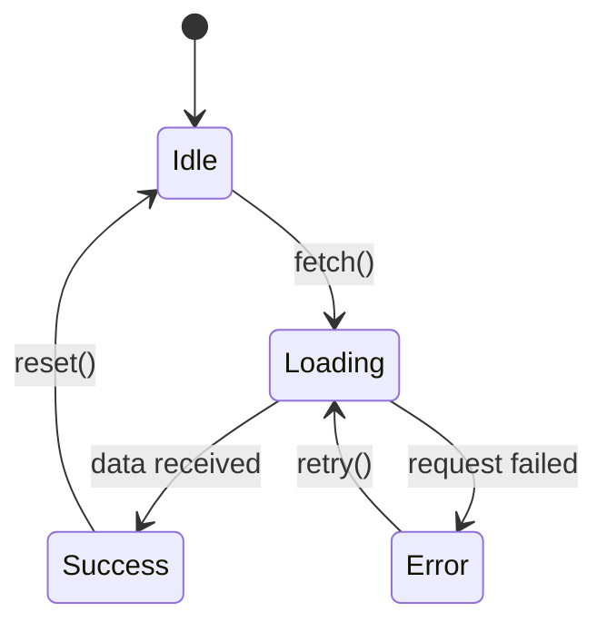

# State Machine Diagrams

For components with multiple states or cross-system flows, create explicit state machine diagrams.

## Why

Forces comprehensive thinking. It's easy to miss edge cases when reasoning about code linearly. A state diagram makes all states and transitions visible, exposing gaps in both design and implementation.

## When to Use

- **Designing** new components with lifecycle states (loading, error, success, etc.)
- **Planning** cross-system flows (user actions → API → database → notifications)
- **Understanding** existing components before modifying them
- **Validating** that implementation handles all intended paths

## How

1. Identify all possible states
2. Map every transition between states
3. For each transition: what triggers it? what are the preconditions?
4. Look for: unreachable states, missing error transitions, ambiguous conditions

## Format

Prefer **Mermaid** when available (renders in GitHub, GitLab, many editors). Fall back to ASCII when Mermaid isn't supported.

**Mermaid example:**


**ASCII example:**
```
                              ┌─────────────────────────────────────────┐
                              │                                         │
                              ▼                                         │
    file selected        ┌─────────┐     valid + size OK          retry │
         ──────────────► │VALIDATING│ ─────────────────┐               │
                         └─────────┘                   │               │
                              │                        ▼               │
                              │                   ┌─────────┐          │
                         invalid                  │UPLOADING│          │
                         / too large              │(progress)│          │
                              │                   └─────────┘          │
                              ▼                        │               │
    ┌──────┐            ┌─────────┐                    │               │
    │ IDLE │◄───────────│  ERROR  │◄───── timeout ─────┤               │
    │      │   dismiss  │(message)│      / network     │               │
    └──────┘            └─────────┘                    │               │
         ▲                    ▲                        ▼               │
         │                    │                   ┌──────────┐         │
         │               server error             │PROCESSING│         │
         │                    │                   │ (server) │         │
         │                    │                   └──────────┘         │
         │                    │                        │               │
         │                    └────────────────────────┤               │
         │                                             │               │
         │              ┌──────────┐      success      │               │
         └──────────────│ COMPLETE │◄──────────────────┘               │
            reset       │(show url)│                                   │
                        └──────────┘                                   │
                              │                                         │
                              └───────── upload another ────────────────┘
```

## What to Look For

- **Unreachable states** - States that no transition leads to
- **Dead ends** - States with no outgoing transitions (intentional?)
- **Missing error transitions** - What happens when X fails?
- **Ambiguous conditions** - Multiple transitions possible from same trigger
- **Implicit states** - States that exist in code but aren't in the model

## Anti-Pattern: Linear Thinking

Without state diagrams, it's easy to only consider:
```
Start → Do thing → Success → Done
```

Missing:
```
Start → Do thing → Fail → ???
Start → Do thing → Timeout → ???
Start → Do thing → Partial success → ???
```

This technique counters superficial analysis by requiring enumeration of all paths rather than just the happy path.
